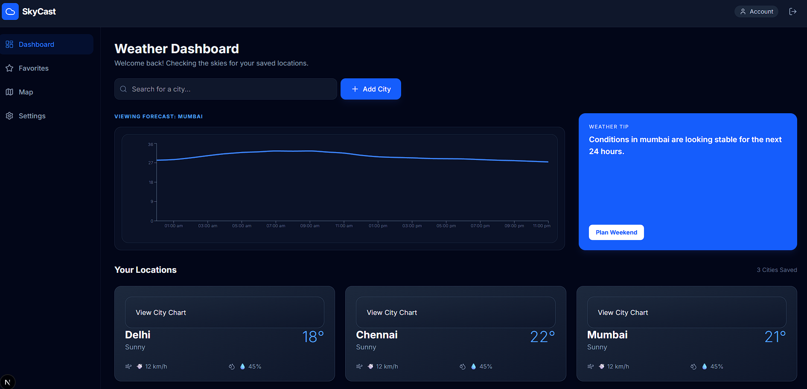
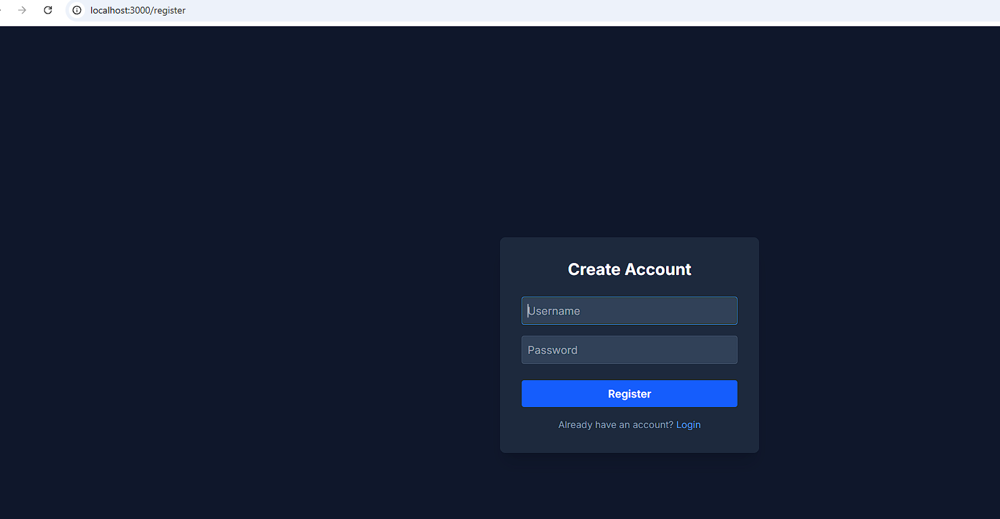

## 🌦️ Weather Insights Dashboard
A full-stack weather forecasting application built with Next.js 14, Node.js/Express, and Material UI. This app provides real-time weather statistics and 7-day forecasts using the Open-Meteo API, secured with JWT authentication.





---

### 🚀 Features
- Secure Authentication: User registration and login powered by JWT (JSON Web Tokens).

- Geocoding Search: Search for any city in India (or worldwide) to retrieve precise weather data.

- Real-time Metrics: View current temperature, wind speed, and human-readable weather conditions.

- Interactive Forecast: A 7-day temperature trend visualized through a responsive Line Chart.

- Modern UI/UX: Clean, responsive dashboard layout built with Material UI (MUI) components.

- Protected Routes: Backend middleware ensures only authenticated users can access weather data.

---

### 🛠️ Tech Stack

### Frontend

- Framework: Next.js 14 (App Router)

- Styling: Material UI (MUI) & Tailwind CSS

- Charts: Recharts

- HTTP Client: Axios

### Backend

- Runtime: Node.js with Express

- Language: TypeScript

- Auth: JWT (jsonwebtoken) & bcrypt for password hashing

- Database: MongoDB / PostgreSQL (Adjust based on your choice)

---

### 📂 Project Structure

- Backend

> /src/controllers: Logic for authentication and weather fetching.

> /src/middleware: JWT verification logic to protect private routes.

> /src/routes: API endpoints definition (e.g., /api/auth, /api/weather).

- Frontend
  
> /app: Next.js App Router folders (Login, Dashboard, Layouts).

> /components/weather: UI components like WeatherCard, SearchBar, and WeatherChart.

> /components/layout: Shared structures like DashboardLayout containing sidebars/navbars.


---

### 🔑 Authentication Flow

- The app follows a standard JWT "Digital Passport" workflow:

- Login: User submits credentials; Backend signs a JWT and returns it.

- Storage: Frontend stores the token in localStorage.

- Authorization: Every weather request sends the token in the Authorization: Bearer <token> header.

- Verification: Backend middleware validates the token signature before returning weather data.

---

### ⚙️ Setup and Installation

1. Clone the repository
```Bash
git clone https://github.com/your-username/weather-dashboard.git
```
2. Backend Setup
   
```Bash
cd backend
npm install
Create a .env file and add:
PORT=5000
JWT_SECRET=your_super_secret_key
DB_URI=your_database_connection_string
npm run dev
```

3. Frontend Setup

```Bash
cd frontend
npm install
npm run dev
```

> The application will be available at http://localhost:3000/login

---

### 📝 License
Distributed under the MIT License. See LICENSE for more information.